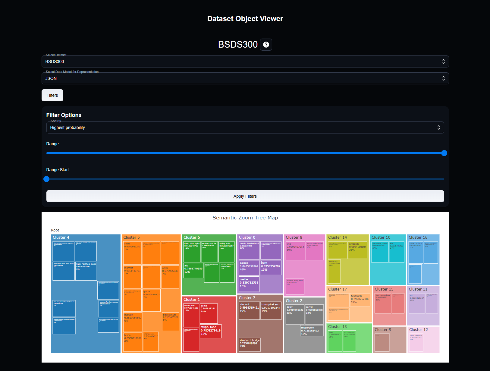

<!--
Hey, thanks for using the awesome-readme-template template.  
If you have any enhancements, then fork this project and create a pull request 
or just open an issue with the label "enhancement".

Don't forget to give this project a star for additional support ;)
Maybe you can mention me or this repo in the acknowledgements too
-->
<div align="center">

  
  <h1>IMPR - Image Smart Processor</h1>
  
  <p>
    A visualization for semantic clustering
  </p>
  
  
<!-- Badges -->
<p>
  <a href="https://github.com/smbursuc/Web-Application-Development/graphs/contributors">
    
  </a>
  <a href="">
    
  </a>
  <a href="https://github.com/smbursuc/Web-Application-Development/network/members">
    
  </a>
  <a href="https://github.com/smbursuc/Web-Application-Development/stargazers">
    
  </a>
  <a href="https://github.com/smbursuc/Web-Application-Development/issues/">
    
  </a>
  <a href="https://github.com/smbursuc/Web-Application-Development/blob/master/LICENSE">
    
  </a>
</p>
   
<h4>
    <a href="https://github.com/Louis3797/awesome-readme-template/">View Demo</a>
  <span> · </span>
    <a href="https://github.com/Louis3797/awesome-readme-template">Documentation</a>
  <span> · </span>
    <a href="https://github.com/Louis3797/awesome-readme-template/issues/">Report Bug</a>
  <span> · </span>
    <a href="https://github.com/Louis3797/awesome-readme-template/issues/">Request Feature</a>
  </h4>
</div>

<br />

<!-- Table of Contents -->
# :notebook_with_decorative_cover: Table of Contents

- [About the Project](#star2-about-the-project)
  * [Screenshots](#camera-screenshots)
  * [Tech Stack](#space_invader-tech-stack)
  * [Features](#dart-features)
  * [Environment Variables](#key-environment-variables)
- [Getting Started](#toolbox-getting-started)
  * [Prerequisites](#bangbang-prerequisites)
  * [Installation](#gear-installation)
  * [Run Locally](#running-run-locally)
- [Usage](#eyes-usage)
- [Roadmap](#compass-roadmap)
- [Contributing](#wave-contributing)
  * [Code of Conduct](#scroll-code-of-conduct)
- [FAQ](#grey_question-faq)
- [License](#warning-license)
- [Contact](#handshake-contact)
- [Acknowledgements](#gem-acknowledgements)

  

<!-- About the Project -->
## :star2: About the Project


<!-- Screenshots -->
### :camera: Screenshots

<div align="center"> 
  
</div>


### :video_camera: Demo

A video demo: https://www.youtube.com/watch?v=CNgJ0re4Xik

<!-- TechStack -->
### :space_invader: Tech Stack

<details>
  <summary>Client</summary>
  <ul>
    <li><a href="https://reactjs.org/">React.js</a></li>
    <li><a href="https://mui.com/">MUI</a></li>
  </ul>
</details>

<details>
  <summary>Server</summary>
  <ul>
    <li><a href="https://flask.palletsprojects.com/en/stable//">Flask</a></li>
    <li><a href="https://spring.io/projects/spring-boot">Spring Boot</a></li>
    <li><a href="https://jena.apache.org/documentation/fuseki2/">Apache Jena Fuseki</a></li>
  </ul>
</details>

<details>
<summary>Database</summary>
  <ul>
    <li><a href="https://hibernate.org">Hibernate</a></li>
    <li><a href="https://www.w3.org/TR/sparql11-query/">SPARQL</a></li>
  </ul>
</details>

<!-- Features -->
### :dart: Features

- Explore data visually from the <a href="https://www2.eecs.berkeley.edu/Research/Projects/CS/vision/bsds/">BSDS300</a> and <a hred="https://www.cs.toronto.edu/~kriz/cifar.html">CIFAR-10</a> datasets.
- Semantic Clustering done by powerful AI for image datasets.
- Correlation heatmaps between objects.
- Data exposed via REST API using JSON and SPARQL data models.

<!-- Env Variables -->
### :key: Environment Variables

The project uses JWT. The secret key is defined in `application.properties` but can be set anywhere desired.
In order to manually add a dataset an API key is needed for Groq, which is used for cluster labeling. Find more about Groq <a href="https://console.groq.com/keys">here</a>.

<!-- Getting Started -->
## 	:toolbox: Getting Started

<!-- Prerequisites -->
### :bangbang: Prerequisites

This project uses <a href="https://www.npmjs.com">npm</a>, <a href="https://gradle.org">Gradle</a> and <a href="https://pypi.org/project/pip/">pip</a> as package managers.

<!-- Installation -->
### :gear: Installation

Install node modules

```bash
  cd frontend/wade-mui
  npm install
```

Install all required dependencies for the Flask server. Those include Flask, Flask Cors, Torch, Tensorflow, Groq etc.

Java dependencies are listed in `build.gradle` and will be automatically fetched and installed when deploying the server.

PostgreSQL database is required. Create a database to match the connection parameters in `application.properties`, or modify at will.

Download Apache Jena Fuseki locally and use the Web interface to create a new dataset named `impr`. Choose `Persistent Memory` and upload the files one by one. The following graph names must be provided for each file upload:
- File: `cluster_data_skos_bsds300` - Graph name: `bsds300_clusters`
- File: `cluster_data_skos_cifar10` - Graph name: `cifar10_clusters`
- File: `heatmap_data_skos_bsds300` - Graph name: `bsds300_heatmap`
- File: `heatmap_data_skos_cifar10` - Graph name: `cifar10_heatmap`

For the image detection service, install <a href="https://www.deepdetect.com/quickstart-server/?source=docker&compute=gpu&gpu=gtx&backend=caffe%2Ctsne%2Cxgboost%2Cncnn&deepdetect=server">DeepDetect</a> dockerized. Create the following service using Postman:

```bash
  curl -X PUT "http://localhost:8080/services/imageserv" -d '{
  "mllib":"caffe",
  "description":"image classification service",
  "type":"supervised",
  "parameters":{
    "input":{
      "connector":"image"
    },
    "mllib":{
      "nclasses":1000
    }
  },
  "model":{
    "repository":"/opt/models/ggnet/"
  }
}'
```


<!-- Run Locally -->
### :running: Run Locally

Clone the project

```bash
  git clone https://github.com/smbursuc/Web-Application-Development.git
```

1. Starting the proxy server (Spring)
   - Deploy normally using an IDE (preferrably IntelliJ).
2. Starting the JSON data server
   - ```bash
     cd text-classification
     python app.py
     ```
3. Starting the SPARQL server
   - Open the installation directory in command line and run `fuseki-server`.
4. Opening the Web client
   - Visit `localhost:3000`.

<!-- Dataset setup -->
### :triangular_flag_on_post: Dataset creation

The source files include the necessary setup to create a SPARQL dataset starting from an image dataset.

The first strage is generating the necessary JSON files.

1. Open `text-classification`.
2. Change `create_json_data.py` parameters to set the input data and output file. 
3. Run `create_json_data.py`. This should produce a file with the format `processed_data_uri_<dataset_name>.json`
4. Change `classification.py` `main` function to use the newly created JSON file.
5. Run `classification.py`. This should produce a file with the format `hierarchial_structure_uri_<dataset_name>.json`.
6. Run `correlation.py`. Make sure the file path is correct for `filepath` in `correlation`. A file with format `similarity_data_<dataset_name>.json` should be produced.

The second stage involves converting the JSON data to `ttl` format.

1. Open `ClusterDataToSKOSConverter.java` and provide the appropiate `hierarchical_structure_uri.json` file path.
2. Run `main`.
3. Open `SKOSHeatMapConverterNew.java` and provide the appropiate `similarity_data.json`
4. Run `main`.

<!-- Usage -->
## :eyes: Usage

1. Create an user or sign up.
2. Enter the `/dashboard` page.
3. Use all 3 pages on the side bar at will. For clusters, click on each cluster to see all its elements.

Swagger documentation can be found at: http://localhost:8081/swagger-ui/index.html#/

<!-- Roadmap -->
## :compass: Roadmap

* [ ] Finish the user interface.
* [ ] Add more robust API parameter checking.
* [ ] Improve exception handling.
* [ ] Refactor React code `SemanticZoom.js` and `Correlations.js` to reuse more code.
* [ ] Add security on the proxy server using Sprint Security.
* [ ] Automate the image detection -> RDF pipeline.
* [ ] Add user related features: dynamic dataset creation, preference savings etc.


<!-- Contributing -->
## :wave: Contributing

*Freaking no one man... ugggggggggggggggggh*

<a href="https://github.com/smbursuc/Web-Application-Development/graphs/contributors">
  
</a>

<!-- Code of Conduct -->
### :scroll: Code of Conduct

Please read the [Code of Conduct](https://github.com/smbursuc/Web-Application-Development/blob/master/CODE_OF_CONDUCT.md)

<!-- FAQ -->
## :grey_question: FAQ

- Is this production ready?

  + No.

- How much time did you spend on this?

  + A few weeks working fulltime. I'm *tired*.


<!-- License -->
## :warning: License

Distributed under the no License. See LICENSE.txt for more information.


<!-- Contact -->
## :handshake: Contact

I'd rather not on a public repo...

Project Link: [https://github.com/smbursuc/Web-Application-Development](https://github.com/smbursuc/Web-Application-Development)


<!-- Acknowledgments -->
## :gem: Acknowledgements

Thanks a lot to Xan Xipiti for providing useful information!

